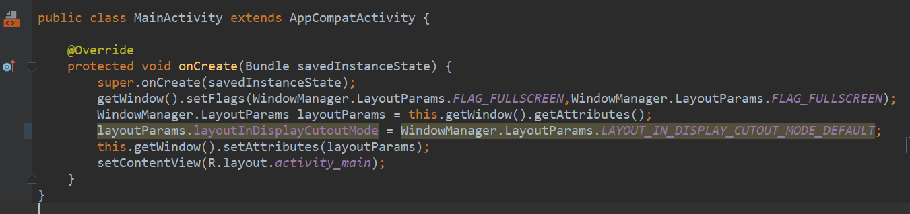
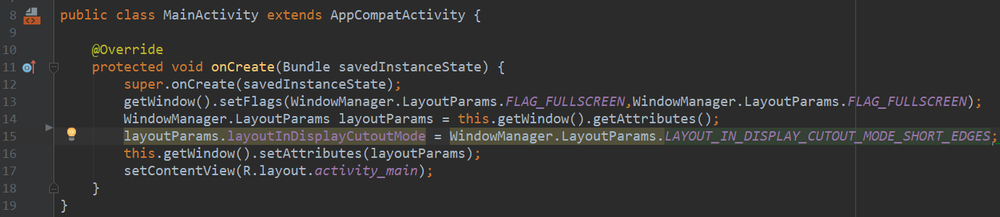

# Android9Demo

## Development Environment

- Android Studio 3.1.1
- Android api 28
- Virtul Devices Nexus 5X


### Display cutout support

預設的Android P關閉瀏海，以下先看看如何開啟模擬器中的瀏海
- 1.啟用開發人員選項和調試
```
1.打開Settings 
2.（僅限Android 8.0或更高版本）選擇System
3.拉到最底下，點選Build Number 7次
4.返回上一頁，點選Developer Options
```

- 2.選擇開發者選項中的Simulate a display with a cutout


裡面Google提供了四種瀏海的形式
第一個選項無瀏海(預設)
第二到四的選項差別就在寬度不一樣

在Android P版本中，可以透過DisplayCutout類別去確定瀏海的位置和形狀
新的窗口佈局屬性 layoutInDisplayCutoutMode允許您的應用在設備的剪裁周圍佈置其內容。您可以將此屬性設置為以下值之一：
```
* LAYOUT_IN_DISPLAY_CUTOUT_MODE_DEFAULT
* LAYOUT_IN_DISPLAY_CUTOUT_MODE_NEVER
* LAYOUT_IN_DISPLAY_CUTOUT_MODE_SHORT_EDGES
```

第一種效果：LAYOUT_IN_DISPLAY_CUTOUT_MODE_DEFAULT




第二種效果：LAYOUT_IN_DISPLAY_CUTOUT_MODE_NEVER


可以看出效果與第一個是一樣的，差別在後者不允許使用瀏海區域，而前者在全屏時不允許使用。

第三種效果：LAYOUT_IN_DISPLAY_CUTOUT_MODE_SHORT_EDGES




可以看到瀏海的地方顯示白色，可使用瀏海區域。
