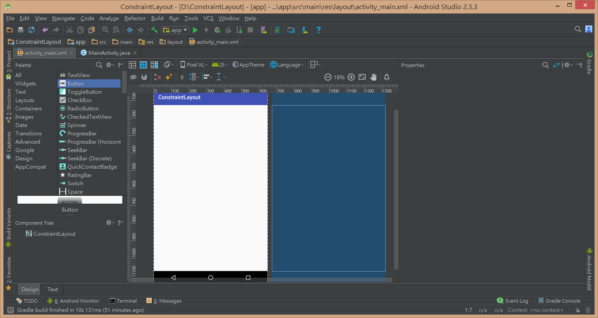
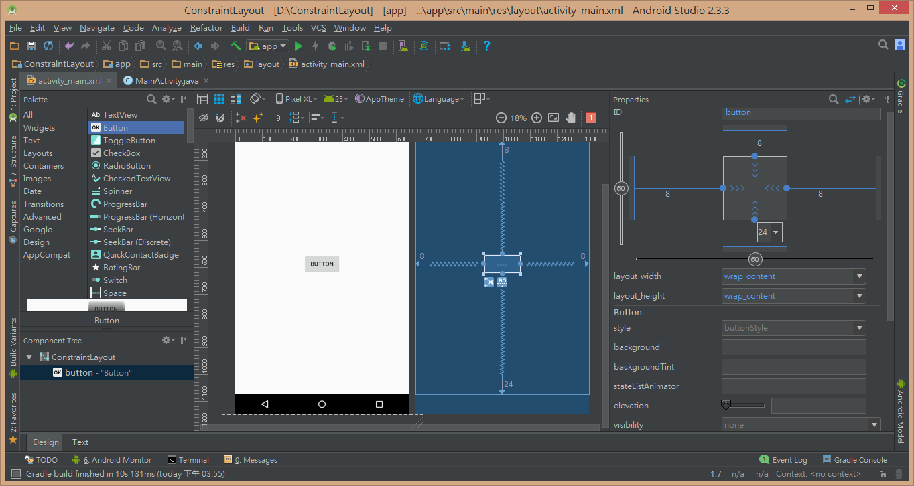
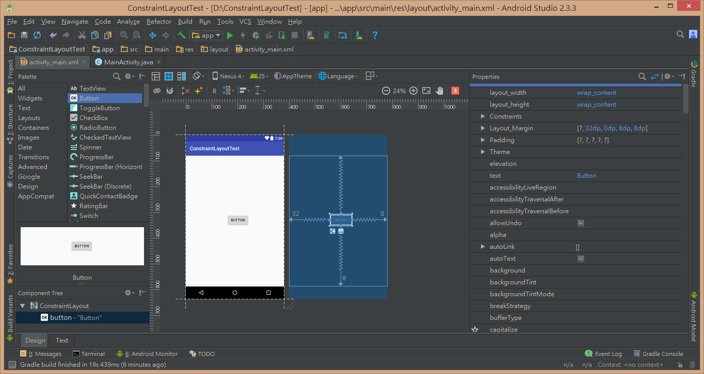
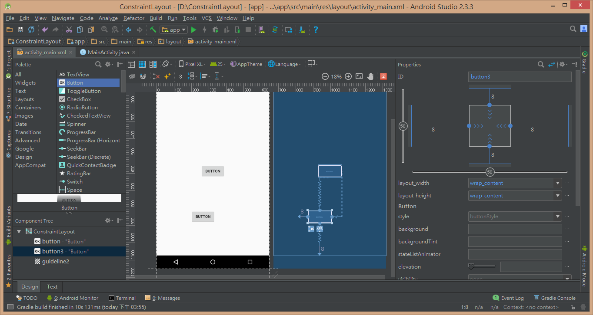

#ConstraintLayout

#### Development Environment
- Windows 8.1
- Android Studio 2.3.3

#### Built Environment
- 開啟 Android Studio

- 建立新的 App 叫做 ConstraintLayout

- 為了使用 ConstraintLayout，需要在 build.gradle 的 dependencies 區塊內加入

```gradle
dependencies {
    'com.android.support.constraint:constraint-layout:1.0.0-beta4'
}
```

#### The Simplest Sample
- activity_main

- 此時左邊的手機介面是用來預覽最後的畫面結果，右邊的藍圖是用來觀察控件間的約束情況
- 要新增控件的話，可以透過左邊的 Palette 來進行

- 新增控件後，可以透過畫面藍圖中的點來替控件增加約束，進而使用右側的 Properties 來設定邊界以及寬高之類的屬性

- 在 Properties 內，邊界的設定可以透過設定數值(dp)，或者用百分比來進行調整

- 控件的所有屬性都可以在 Properties 裡面來進行設定

- 除了與 ConstraintLayout 進行約束之外，也可以跟其他的控件進行約束，如上圖
- 上圖中的鉛垂線為 Guidelines，可以用來幫助排版

#### Contributors
Wei

#### Troubleshooting
