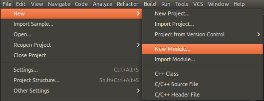
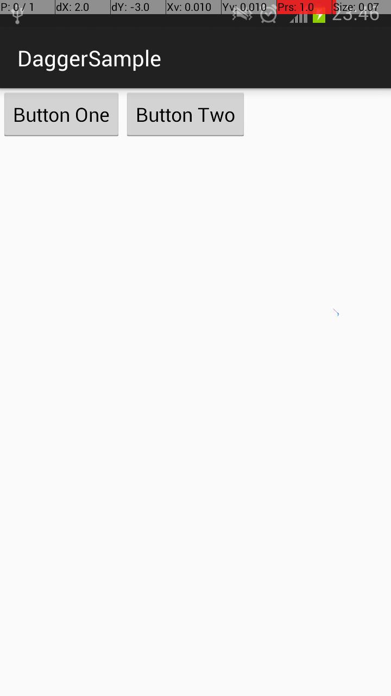

#Dagger

#### Development Environment
- Ubuntu 15.04
- Android Studio 1.3.2

#### Built Environment
- 開啟 Android Studio

- 建立新的 Module 叫做 app



- 開啟 app Module 的 build.gradle，在 dependencies 區塊加入，例：

```gradle
dependencies {
    // compile 代表會在應用程式執行階段，使用到這個函式庫。
    compile 'com.squareup.dagger:dagger:1.2.+'
    // provided 代表在應用程式執行階段，不會使用到這個函式庫。
    provided 'com.squareup.dagger:dagger-compiler:1.2.+'
}
```

#### The Simplest Sample
```java
public class MainActivity extends AppCompatActivity {
    // 標注待注入的類別屬性。
    @Inject
    // 有兩個相同型態的屬性要注入時，使用 Named 為"ButtonOne"的 provide 方法。
    @Named("ButtonOne")
    // 此屬性將不用在OnCreate方法中，執行new初始化或賦值等動作。
            Button buttonOne;

    @Inject
    @Named("ButtonTwo")
    Button buttonTwo;

    @Override
    protected void onCreate(Bundle savedInstanceState) {
        super.onCreate(savedInstanceState);
        // 用 create() 靜態方法取得 ObjectGraph，參數放入自訂的 Module。
        ObjectGraph graph = ObjectGraph.create(new AppModule(this));
        // 呼叫 ObjectGraph 物件的 inject() 方法，對自己類別中有標注 @Inject 的屬性做注入。
        graph.inject(this);

        // 建立並設定畫面。
        LinearLayout container = new LinearLayout(this);
        container.addView(buttonOne);
        container.addView(buttonTwo);
        setContentView(container);
    }

    // 類別中的方法如標注 @Provides，則類別須被標注 @Module。
    // injects 參數設定此 Module 要注入的類別。
    // library 參數設定為true，允許未使用的 @Provides 方法不會被 javac 阻擋導致編譯失敗。
    @Module(injects = {MainActivity.class}, library = true)
    class AppModule {
        private Context context;

        public AppModule(Context context) {
            this.context = context;
        }

        // 標注 @Provides 的方法會成為自動注入時的被呼叫的方法之一，被選擇的方式是透過回傳值自動判斷。
        @Provides
        // 每次自動注入時都會取得同一個物件。
        @Singleton
        // 避免相同回傳值的情況，要被注入的屬性可以使用相同的名稱指定 provide 方法。
        @Named("ButtonOne")
        // 名稱不一定要取 provide 開頭，只是官方範例都會這樣取名。
        public Button provideButton() {
            // 在 provide 方法中設定要注入的物件細節。
            Button button = new Button(context);
            button.setText("Button One");
            return button;
        }

        @Provides
        @Singleton
        @Named("ButtonTwo")
        public Button provideButtonTwo() {
            Button button = new Button(context);
            button.setText("Button Two");
            return button;
        }
    }
}
```



#### Contributors
ChrisKe

#### Troubleshooting
