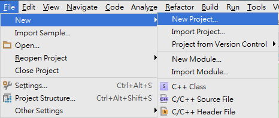
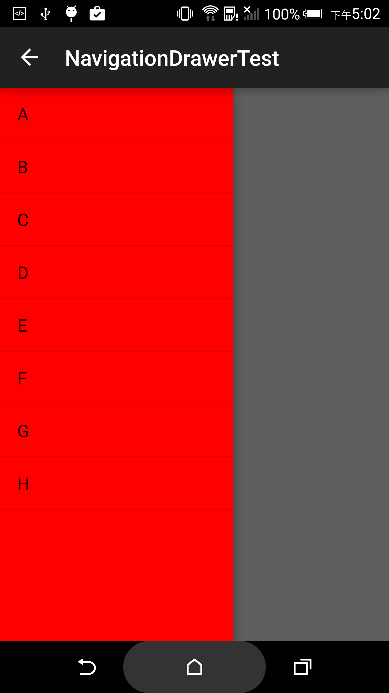

#DrawerLayout

#### Development Environment
- Windows 7
- Android Studio 1.3.1

#### Built Environment
- 開啟 Android Studio

- 建立新的 App 叫做 DrawLayout



- 開啟 DrawLayout Project 的 build.gradle，在 dependencies 區塊加入，例：

```gradle
dependencies {
    compile fileTree(include: ['*.jar'], dir: 'libs')
    // compile 代表會在應用程式執行階段，使用到這個函式庫，這邊使用appcompat-v7的23.0.1版。
    compile 'com.android.support:appcompat-v7:23.0.1'
    // compile 代表會在應用程式執行階段，使用到這個函式庫，這邊使用support-v4的23.0.1版。
    compile 'com.android.support:support-v4:23.0.1'
}
```

#### The Simplest Sample
```java
public class MainActivity extends AppCompatActivity {
    private MainLayout layout;
    private ActionBarDrawerToggle mDrawerToggle;
    @Override
    protected void onCreate(Bundle savedInstanceState) {
        super.onCreate(savedInstanceState);

        initActionBar();
        initDrawerLayout();
        initDrawerList();
    }

    /***
     * 在navigation drawer結合ActionBar，讓ActionBar的返回箭號顯現，並且讓 App icon 可以被點選。
     */
    private void initActionBar() {
        getSupportActionBar().setDisplayHomeAsUpEnabled(true);
        getSupportActionBar().setHomeButtonEnabled(true);
    }

    /***
     * 讓側選單出現的初始化設定
     */
    private void initDrawerLayout() {
        setContentView(layout = new MainLayout(this));

        //建立側選單觸發器，其中會將側選單、開啟和關閉指令等參數指定給ActionBarDrawerToggle(使用appcompat-v7)
        mDrawerToggle = new ActionBarDrawerToggle(this, layout.drawerLayout, R.string.drawer_open, R.string.drawer_close){
            //下面是兩個覆寫方法，分別是啟側選單 onDrawerOpened 及關閉側選單 onDrawerClosed，可以再開啟或關閉當中指定動作。
            @Override
            public void onDrawerClosed(View drawerView) {
                super.onDrawerClosed(drawerView);
            }

            @Override
            public void onDrawerOpened(View drawerView) {
                super.onDrawerOpened(drawerView);
            }
        };

        //呼叫syncState(); 讓 ActionBar 中的返回箭號置換成三條線圖示。
        mDrawerToggle.syncState();

        //讓drawerLayout聆聽這個觸發器
        layout.drawerLayout.setDrawerListener(mDrawerToggle);
    }

    /***
     * 在側選單中以listView方式顯示，用字串陣列建立adapter放到listView中
     */
    private void initDrawerList() {
        String[] drawArray = this.getResources().getStringArray(R.array.items_array);
        ArrayAdapter<String> adapter = new ArrayAdapter<String>(this, android.R.layout.simple_list_item_1, drawArray);
        layout.listView.setAdapter(adapter);
    }

    /***
     * 讓appicon可以做開關選單的動作
     * @param item
     * @return
     */
    @Override
    public boolean onOptionsItemSelected(MenuItem item) {

        if (mDrawerToggle.onOptionsItemSelected(item)) {
            return true;
        }
        return super.onOptionsItemSelected(item);
    }
}
```



#### Contributors
MaxJiang

#### Troubleshooting
- 因為要使用側選單的話，LayoutParams 要使用 DrawLayout 專用的，而且在屬性方面除了給予寬高，還須設定選單初始化位置，例:
```java
    private ListView listView() {
        DrawerLayout.LayoutParams params = new DrawerLayout.LayoutParams(ruler.getW(60), LayoutParams.MATCH_PARENT, Gravity.LEFT);

        ListView v = new ListView(getContext());
        v.setBackgroundColor(Color.RED);
        v.setLayoutParams(params);
        return v;
    }
```