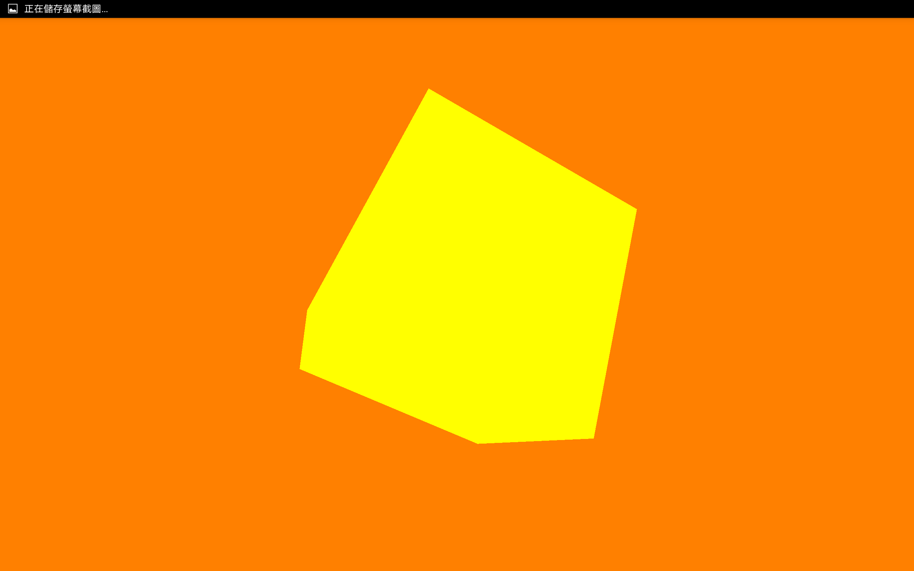

#GLSurfaceView

#### Development Environment
- Windows 7 SP1
- Android Studio 1.4

#### Built Environment
- 開啟 Android Studio 

- 建立新的 project 叫做 OpenGLSurfaceView

#### The Simplest Sample
- 修改 MainActivity 
```JAVA
public class MainActivity extends Activity {
private GLSurfaceViewLayout glSurfaceView;

    @Override
    protected void onCreate(Bundle savedInstanceState) {
        super.onCreate(savedInstanceState);
        setContentView(glSurfaceView = new GLSurfaceView(this));

        // 設置 GLSurfaceView 
        glSurfaceView.setRenderer(new GLRenderer());
    }

    @Override
    protected void onResume() {
        super.onResume();
        glSurfaceView.onResume();
    }

    @Override
    protected void onPause() {
        super.onPause();
        glSurfaceView.onPause();
    }
}
```
- 新建一個 Class 叫做 GLRenderer 並且實作 GLSurfaceView.Renderer 介面
```JAVA
public class GLRenderer implements GLSurfaceView.Renderer {
    // 設定頂點 buffer
    private FloatBuffer verticesBuffer;
    // 設定順序 buffer
    private ShortBuffer indexBuffer;
    // 設定角度
    private float angle = 0f;

    // 頂點座標
    private float vertices[] = {
            -1.0f, -1.0f, -1.0f,  // 0
            1.0f, -1.0f, -1.0f,   // 1
            1.0f, 1.0f, -1.0f,    // 2
            -1.0f, 1.0f, -1.0f,   // 3
            -1.0f, -1.0f, 1.0f,   // 4
            1.0f, -1.0f, 1.0f,    // 5
            1.0f, 1.0f, 1.0f,     // 6
            -1.0f, 1.0f, 1.0f,    // 7
    };
    // 頂點索引
    private short index[] = {
            0, 4, 5,
            0, 5, 1,
            1, 5, 6,
            1, 6, 2,
            2, 6, 7,
            2, 7, 3,
            3, 7, 4,
            3, 4, 0,
            4, 7, 6,
            4, 6, 5,
            3, 0, 1,
            3, 1, 2,};

    @Override
    // 此方法設置一些繪製時不常改變的參數
    public void onSurfaceCreated(GL10 gl, EGLConfig config) {
        // 設置背景顏色 ( RGBA )
        gl.glClearColor(1.0f, 0.5f, 0.0f, 0.5f);
        // 啟用平滑的底紋，不一定需要
        gl.glShadeModel(GL10.GL_SMOOTH);
        // 設定深層 buffer
        gl.glClearDepthf(1.0f);
        // 啟用深層測試
        gl.glEnable(GL10.GL_DEPTH_TEST);
        // 執行深度測試的類型
        gl.glDepthFunc(GL10.GL_LEQUAL);
        // 設定透視修正
        gl.glHint(GL10.GL_PERSPECTIVE_CORRECTION_HINT, GL10.GL_NICEST);
    }

    @Override
    // 當螢幕更換顯示方向時執行此方法
    public void onSurfaceChanged(GL10 gl, int width, int height) {
        // 設定當前的畫面座標
        gl.glViewport(0, 0, width, height);
        // 設置為投影矩陣
        gl.glMatrixMode(GL10.GL_PROJECTION);
        // 計算畫面的寬高比，以及遠小近大的立體效果
        GLU.gluPerspective(
                gl,                             // 有效的 GL10
                65.0f,                          // 視角
                (float) width / (float) height, // 方向
                0.1f,                           // 近的 Z 軸
                100.0f);                        // 遠的 Z 軸
        // 設置為模型畫面矩陣
        gl.glMatrixMode(GL10.GL_MODELVIEW);
        // 重置畫面矩陣
        gl.glLoadIdentity();
    }

    @Override
    // 定義實際繪圖的操作
    public void onDrawFrame(GL10 gl) {
        // 清除畫面以及深層緩衝
        gl.glClear(GL10.GL_COLOR_BUFFER_BIT | GL10.GL_DEPTH_BUFFER_BIT);
        // 設定當前畫面矩陣為模型畫面矩陣
        gl.glMatrixMode(GL10.GL_MODELVIEW);
        // 重置畫面矩陣
        gl.glLoadIdentity();
        // 設置視角 ( 通常不會改變 )
        GLU.gluLookAt(gl, 0, 0, 4, 0, 0, 0, 0, 1, 0);
        // 設定 繪製前向面的頂點順序為逆時針方向
        gl.glFrontFace(GL10.GL_CCW);
        // 啟用忽略面 ( FACE )
        gl.glEnable(GL10.GL_CULL_FACE);
        // 指定忽略後向面
        gl.glCullFace(GL10.GL_BACK);
        // 啟用頂點 buffer 的寫入，以及要使用的喧染過程
        gl.glEnableClientState(GL10.GL_VERTEX_ARRAY);

        // 設定顏色 ( RGBA )
        gl.glColor4f(1f, 1f, 0f, 0f);

        // 旋轉立方體 (角度, X, Y, Z)
        gl.glRotatef(angle, 1.0f, 0.0f, 0.0f);
        gl.glRotatef(angle, 0.0f, 1.0f, 0.0f);
        gl.glRotatef(angle, 0.0f, 0.0f, 1.0f);
        angle++;

        // 設定頂點以及索引 Buffer
        setVerticesBuffer();
        setIndexBuffer();

        // 畫出立方體
        // 指定 繪製時使用頂點座標的數據格式以及位置
        gl.glVertexPointer(
                3,                          // 頂點數量
                GL10.GL_FLOAT,              // 頂點類型
                0,                          // 起始位置
                verticesBuffer);            // 頂點 buffer
        // 透過索引 Buffer 來繪製面 ( 三角面 )
        gl.glDrawElements(
                GL10.GL_TRIANGLES,          // 模式
                index.length,               // 順序數量
                GL10.GL_UNSIGNED_SHORT,     // 順序
                indexBuffer);               // 索引 buffer


        // 關閉頂點 buffer 的寫入
        gl.glDisableClientState(GL10.GL_VERTEX_ARRAY);
        // 關閉忽略面 ( FACE )
        gl.glDisable(GL10.GL_CULL_FACE);
    }

    // 設定頂點 Buffer
    protected void setVerticesBuffer() {
        // 為節省效能，使用 buffer 存取
        ByteBuffer vbb = ByteBuffer.allocateDirect(vertices.length * 4);
        vbb.order(ByteOrder.nativeOrder());
        verticesBuffer = vbb.asFloatBuffer();
        verticesBuffer.put(vertices);
        verticesBuffer.position(0);
    }

    // 設定索引 Buffer
    protected void setIndexBuffer() {
        // 為節省效能，使用 buffer 存取
        ByteBuffer ibb = ByteBuffer.allocateDirect(index.length * 2);
        ibb.order(ByteOrder.nativeOrder());
        indexBuffer = ibb.asShortBuffer();
        indexBuffer.put(index);
        indexBuffer.position(0);
    }
}
```




#### Contributors
Kevin Chen
#### Troubleshooting
