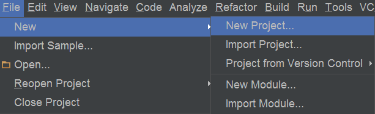

# Gson
***
### Development Environment
* Android Studio 

### Built Environment
* 開啟 Android Srudio
* 建立新的 project 叫做 Gson



* 開啟 Gson 的 build.gradle(Module:app)，在 dependencies 區塊加入，例：
```java
 dependencies {
    compile fileTree(dir: 'libs', include: ['*.jar'])
    compile 'com.android.support:appcompat-v7:22.2.0'
    //compile 代表會在應用程式執行階段，使用到這個函式庫
    //目前最新版本2.5
    compile 'com.google.code.gson:gson:2.5'
}
```

### The Simplest Sample
```java
public class MainActivity extends Activity {

    @Override
    protected void onCreate(Bundle savedInstanceState) {
        super.onCreate(savedInstanceState);
        setContentView(R.layout.activity_main);
        //建立Classmate物件
        Classmate classmate = new Classmate("Jerry",20,"01-123456789");
        //建立Gson物件
        Gson gson = new Gson();
        //將Classmate物件轉換成Json
        String Json = gson.toJson(classmate);
        System.out.println(Json);

        //將Json轉換成物件
        Classmate classmateJson =  gson.fromJson(Json,Classmate.class);
        System.out.println(classmateJson.getname());
        System.out.println(classmateJson.getage());
        System.out.println(classmateJson.getphone());

    }
}
//建立同學通訊錄類別
class Classmate {
    private String name;
    private int age;
    private String phone;
//建構子
    public Classmate(String name, int age, String phone) {
        this.name = name;
        this.age = age;
        this.phone = phone;
    }

    public String getname() {return this.name;}
    public void setName(String name){this.name=name;}
    public int getage() {return this.age;}
    public void setage(int age){this.age=age;}
    public String getphone() {return this.phone;}
    public void setphone(String phone){this.phone=phone;}
}
```
### Result
```java
 {"name":"Jerry","phone":"01-123456789","age":20}
System.out﹕ Jerry
System.out﹕ 20
System.out﹕ 01-123456789
```

