# Instant App


## Development Environment

- Android Studio 3.0.1

## Built Environment

### 開發環境

- 開啟 Android Studio

- 建立一個名稱為 "InstantApp" 的 Project

- 開啟 Tools >Android > SDK Manager

- 安裝 "Instant Apps Development SDK"


### 將 Project 的 Module type 從 Application 轉成 feature

- 在左列的 app 上右鍵，重新命名為 "base-feature"

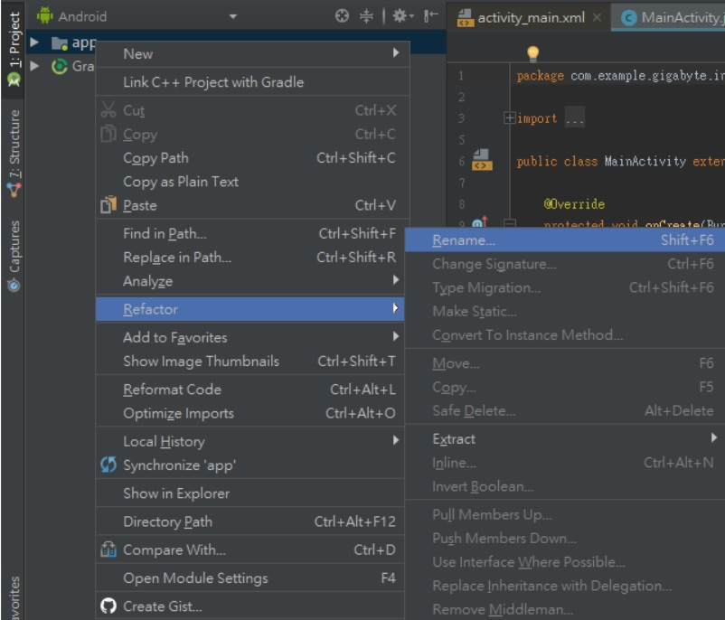

- 修改 base-feature/build.gradle 


```JAVA
//將 application 改為 feature
//apply plugin: 'com.android.application'
apply plugin: 'com.android.feature'
```

- 註解 applicationId
```JAVA
android {
    defaultConfig {
        //base-feature 已經不再是 application module
        //因此註解 applicationId
        //applicationId "com.example.gigabyte.instantapp"
         ...
}        
```

- 指定 baseFeature
```JAVA
android {
    //指定 base-Feature 為此 project 的 base Feature
    baseFeature = true
    ...
}        
```
- Sync Project

### 定義 App Links
- 選擇 Tools > App Links Assistant 


- 點選"Open URL Mapping Editor 並新增鏈結

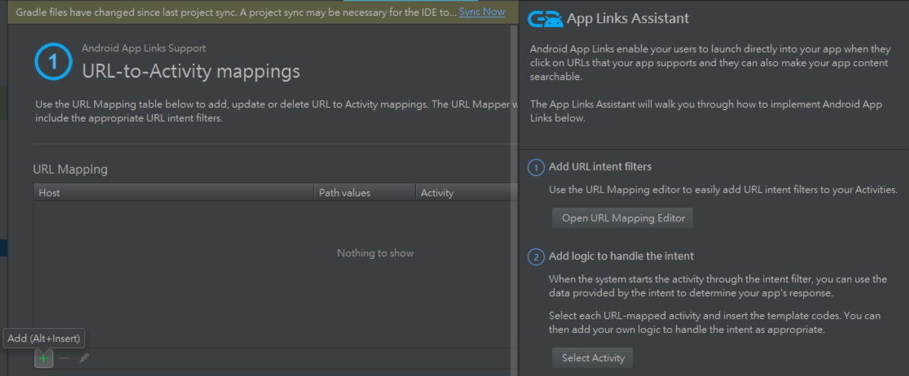

- Host: http://test

- Path: /main 

- Activity: .MainActivity

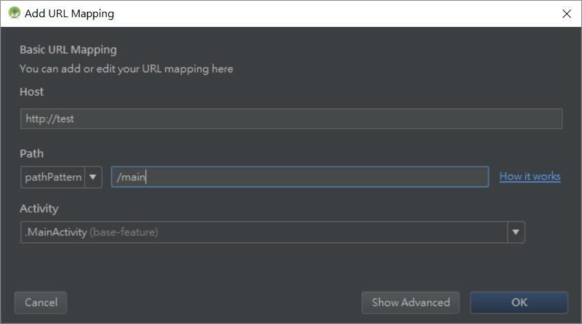

### 建立  APK file

- 選擇 File->New Module

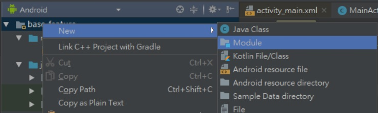
- 選擇 "Phone & Tablet Module"

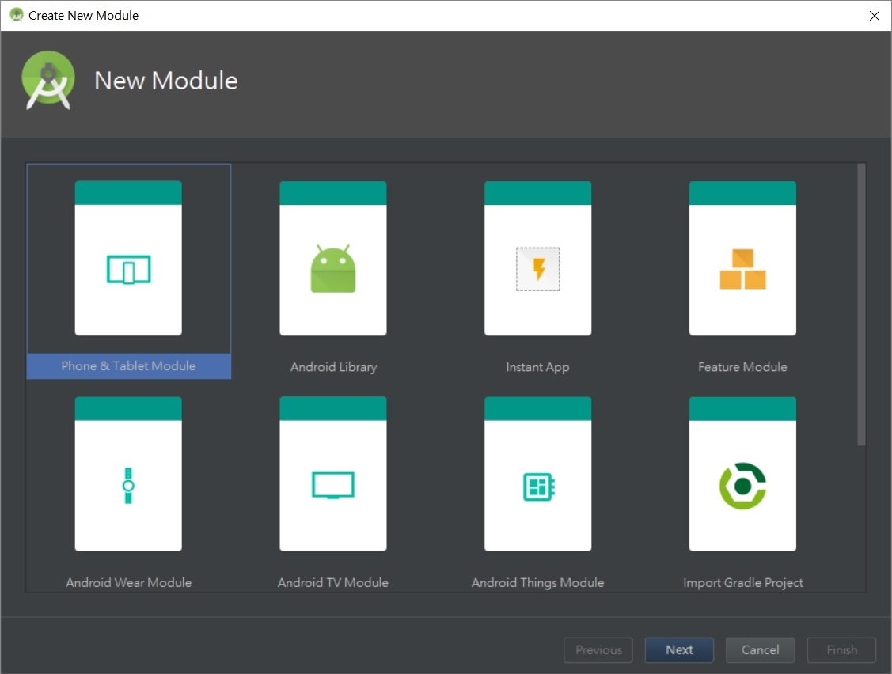
- 修改名稱為 "App"，並將 Package name 修改為 "App"

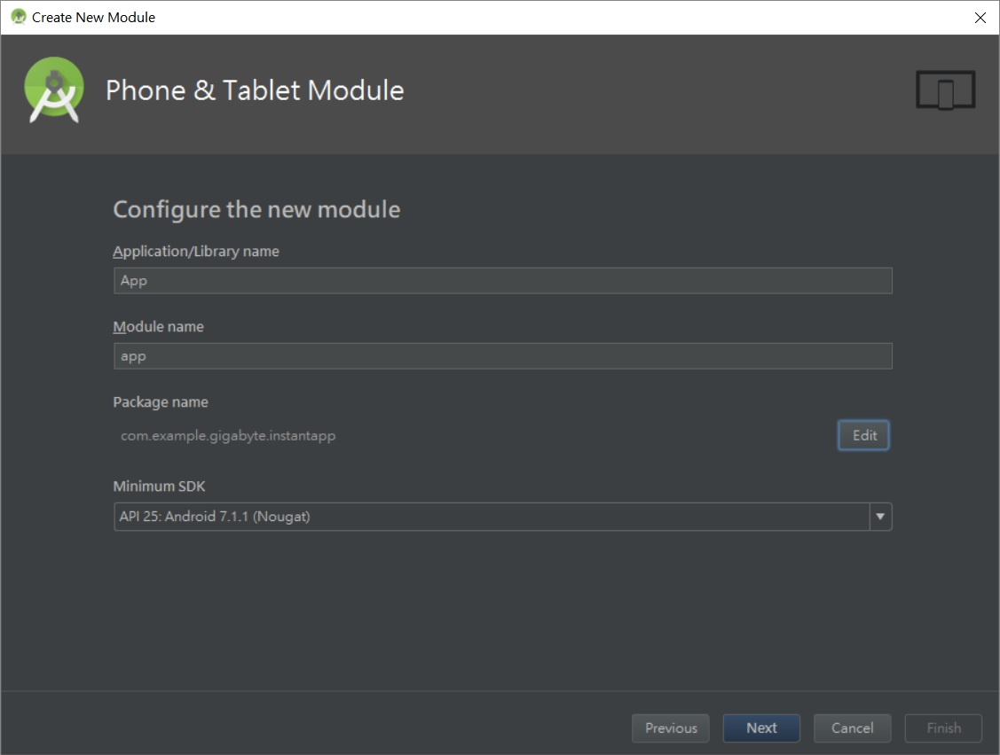
- 選擇 "Add No Activity"，並 finish

- 將檢視模式從 Android 改為 Project

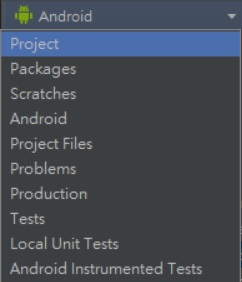

- 刪除多餘的檔案

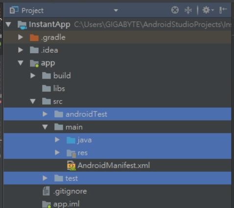

- 將檢視模式改回 Android
- 修改 app/build.gradle 
```JAVA
//將整個 dependencies 刪除並修改為以下
dependencies {    
    implementation fileTree(dir: 'libs', include: ['*.jar'])
    //將底層 feature 導入
    implementation project(":base-feature")
}
```

- 在 base-feature/build.gradle 新增:

```gradle
dependencies {
    ...
    
    application project(":app")
}
```
- Sync Project

- 選擇 app 並測試是否正常


- 測試完成後 刪除此應用程式 (InstantApp)


### 製作 Instant App module

- 右鍵 InstantApp，新增module

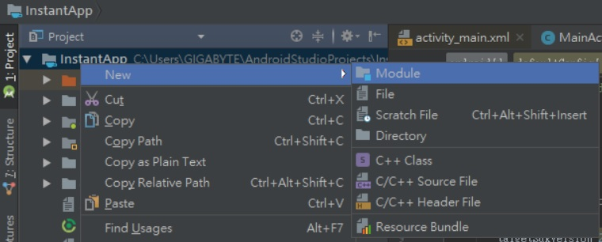

- 選擇 "Instant App"

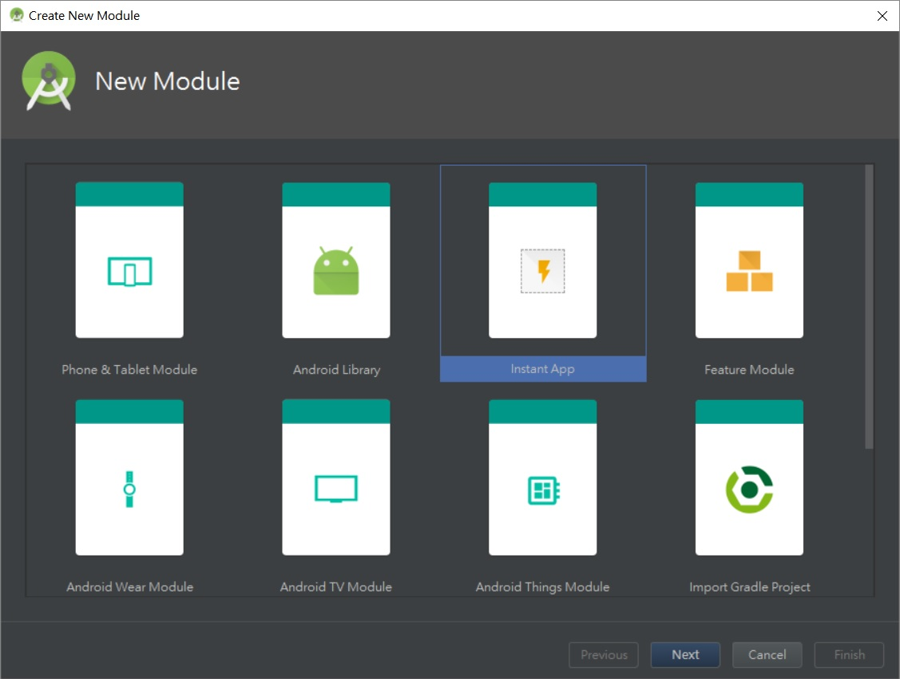
- 並 Next > Finish


- 在 instantapp/build.gradle 新增:
```JAVA
dependencies {
    implementation project(":base-feature")
}
```
- Sync Project

- 選擇 instantapp，檢查是否成功運行 Instant Module


### 製作 Multi-Feature Instant App

- 右鍵 InstantApp，新增module


- 選擇 "Feature Module"

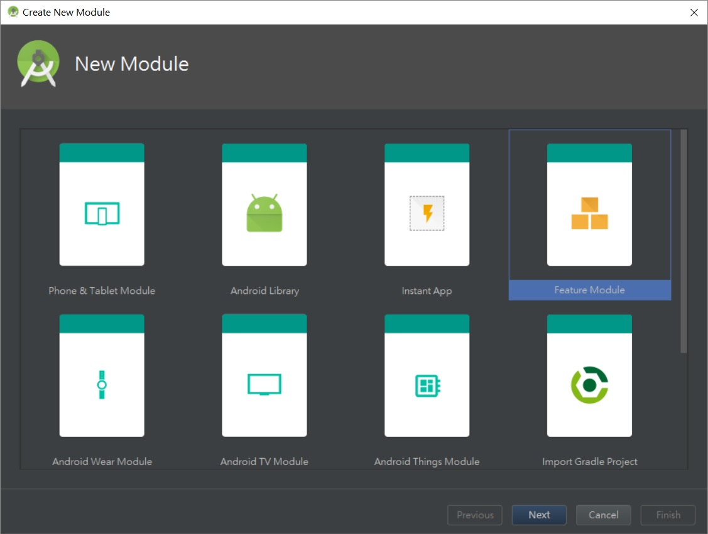
 - Application/Library name 為 "second-feature"
 - 並修改 Packge name 為 "com.example.gigabyte.instantapp.second_feature" 
 (必須接上 app 的 applicationId 因此需在中間加入 instantapp)


- 修改 Instant App URL Route 與 Activity name

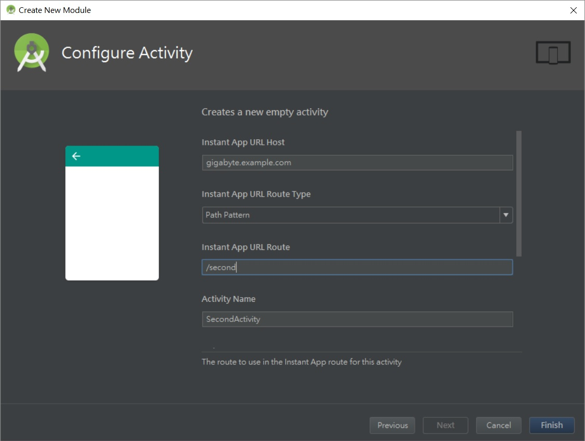
- Finish

- 建立完成後，Android Studio 已經在 second-feature/build.gradle 完成以下
```JAVA
dependencies {
    implementation project(':base-feature')
}
```
- 但是需要自行修改 base-feature/build.gradle 
```JAVA
dependencies {
    ...
    //修改 implementation 'com.android.support:appcompat-v7:26.1.0'
    //因為 second-feature 無法 implementation base-feature 的 appcompat
    compile 'com.android.support:appcompat-v7:26.1.0'
    ...
}
```

- 修改 second-feature/src/main/AndroidManifest.xml 的 App Links
```xml=
<application>   
    ...    
    <intent-filter android:order="1">
        <data
            android:scheme="http"
            android:host="test"
            android:pathPattern="/second" />
    </intent-filter>
    ...
</application>             
```
- 在 app/build.gradle 新增
```JAVA
dependencies {
    ...
    implementation project(":second-feature")
    ...
}
```

- 在 instantapp/build.gradle 新增
```JAVA
dependencies {
    ...
    implementation project(":second-feature")
    ...
}
```

## The Simplest Sample

- 修改 second-feature/src/main/res/layout/activity_second.xml 
```xml
<TextView
    ...
    android:text="Second-feature!"
    ...
/>
```

- 選擇 instantapp，檢查是否成功運行


- 如果有安裝 adb 則在 Command Line 輸入以下，測試每個 feature
```
adb shell am start -a android.intent.action.VIEW -d "http://test/main"
adb shell am start -a android.intent.action.VIEW -d "http://test/second"
``` 

## Contributors
Yang Huang
