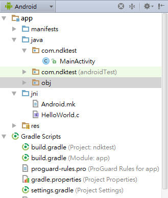
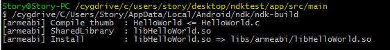

# NDK Hello World

#### Development Environment
- windows 7
- Android Studio 1.4

#### Built Environment For Windows
- NDK下載地
- http://developer.android.com/intl/zh-tw/ndk/downloads/index.html
- 可以compiler c的檔案
- http://www.cygwin.com/install.html

- 開啟 Android Studio

- 建立新的 project 叫做 ndktest

- 在Project的gradle.properties文件中增加一行 
```properties     
        android.useDeprecatedNdk=true
```

- 在Project的local.properties文件中增加一行ndk所在目錄 ( 注意':'和'\'要進行轉邊 )：
```properties
        ndk.dir=C\:\\Users\\Story\\AppData\\Local\\Android\\ndk
```

- 打開在工具列的Project Structure 


- 修改NDK location


#### The Simplest Sample

- 在main底下新增一個jni的資料夾 (compile時會自動進入名稱為jni的資料夾)


- 在底下創一個C文件以及mk檔

- C文件的撰寫

```C
#include <string.h>
#include <jni.h>
/*Jstring 為返回值 ,也可以為 void , jint 等等 類型
 C文件中方法的命名規則
 Java_Package名子_Activity名子_方法名
 */
jstring  Java_com_ndktest_MainActivity_stringFromJNI( JNIEnv* env, jobject thiz )
{
    return (*env)->NewStringUTF(env, "HelloWorld! ");
}
```

- mk檔的撰寫

```mk
#FileName:Android.mk
#Description:makefile of Helloworld
#Android.mk 文件首先必須定義好LOCAL_PATH變量，my-dir是用來返回當前路徑
LOCAL_PATH := $(call my-dir)

#CLEAR_VARS由編譯系統提供，指定讓GNU MAKEFILE為你清除許多LOCAL_XXX變量
include $(CLEAR_VARS)

#名稱必須是唯一的，而且不包含任何空格
LOCAL_MODULE    := HelloWorld

#列出直接傳遞到編譯器的c文件
LOCAL_SRC_FILES := HelloWorld.c

#BUILD_SHARED_LIBRARY表示編譯生成共享庫，是編譯系統提供的變量
include $(BUILD_SHARED_LIBRARY)
```

- 開啟 app Module 的 build.gradle，在 dependencies 區塊加入，例：

```gradle
  defaultConfig {
        applicationId "com.ndktest"
        minSdkVersion 15
        targetSdkVersion 23
        versionCode 1
        versionName "1.0"
        //需要輸入ndk module
        ndk {
            moduleName "HelloWorld"
        }
    }
```


- MainActivity的改寫

```java
package com.ndktest;

import android.app.Activity;
import android.os.Bundle;
import android.widget.TextView;

public class MainActivity extends Activity {

    public void onCreate(Bundle savedInstanceState)
    {
        super.onCreate(savedInstanceState);
        TextView tv = new TextView(this);
        tv.setText( stringFromJNI() );
        setContentView(tv);
    }
    
    //宣告方法
    public native String  stringFromJNI();

    //靜態載入So庫
    static {
        System.loadLibrary("HelloWorld");
    }
}

```
- 打開cygwin進入專案main的位置
- 並打上你的ndk裡的ndk-build



- 執行APP的結果


#### Contributors
Lyon Lin

#### Troubleshooting
