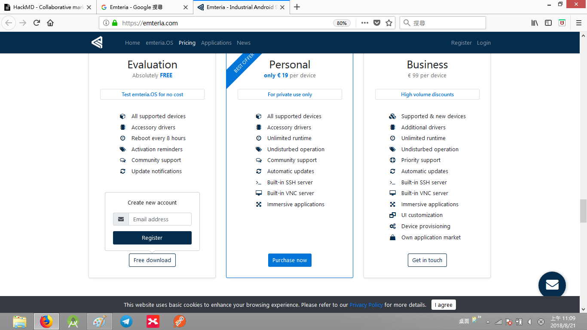
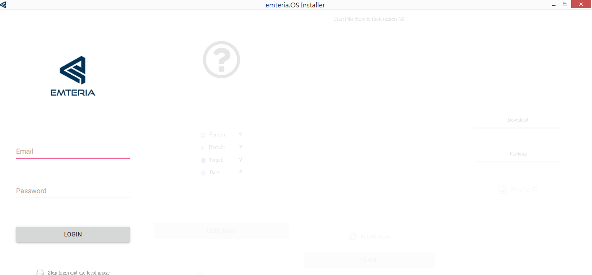
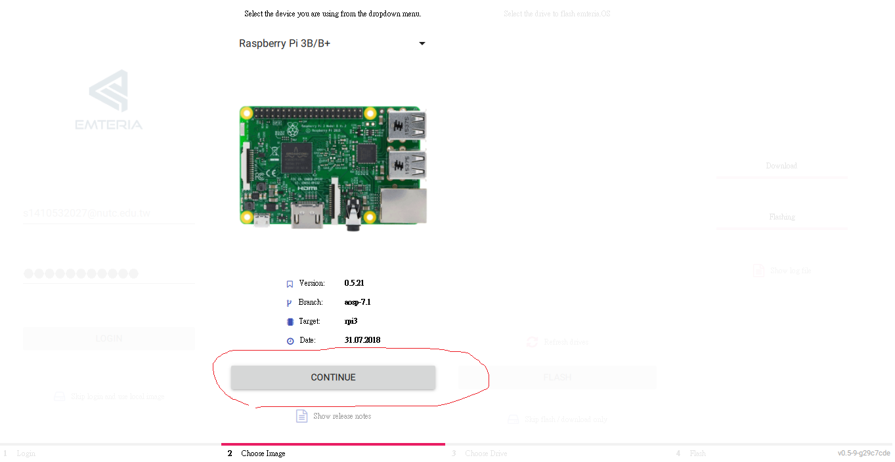
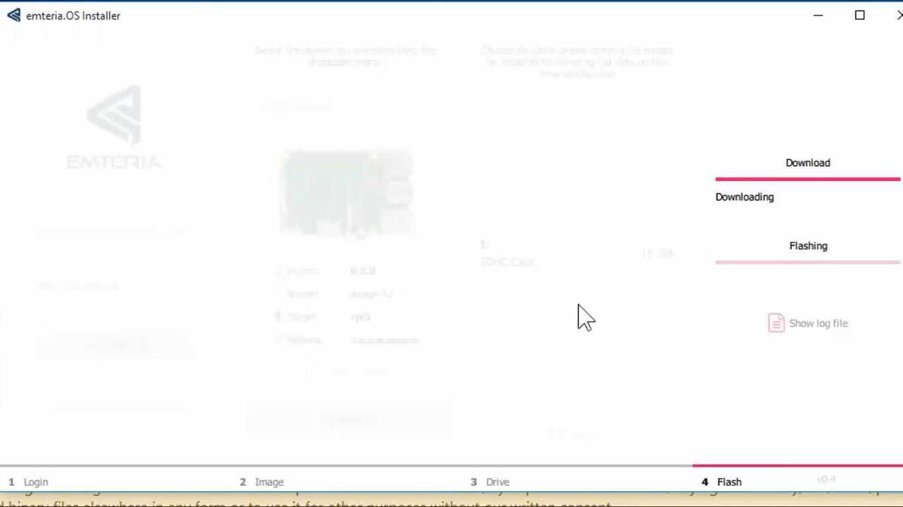

## android for raspberry  pi 3 download 
首先先到Emteria的官方網站下載
https://emteria.com/

點選Free download

**記得要先註冊會員才可以註冊**
進入底下畫面並點選windows x64去下載

點選此檔案按下載(下載依照預設一直點下一步就行了)

下載完成後插入轉接卡後再開啟Emteria

(注意!這裡還在再登錄一次)
點選CONTINUE，點選OK就會開始燒入了。

等待燒入完成後就可以拔出SDcard了。